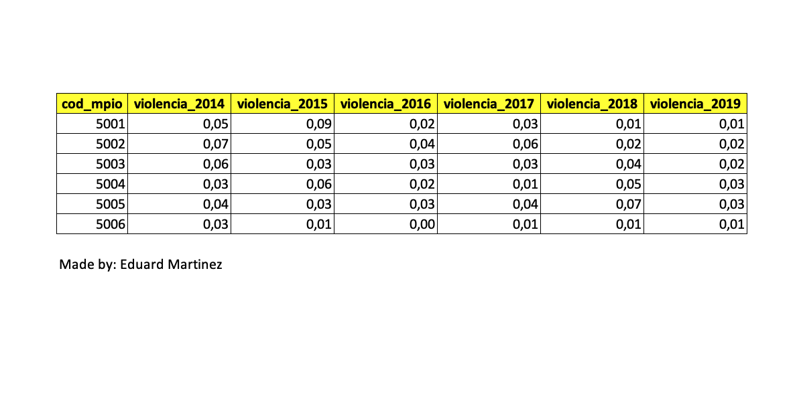
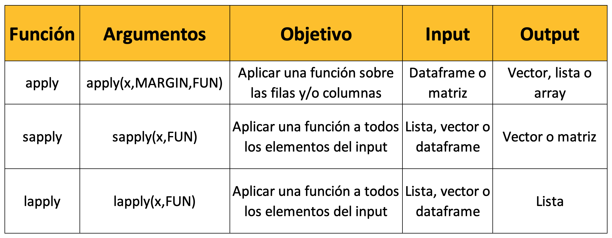

```{r setup, include=FALSE}
# load packages
library(pacman)
pacman::p_load(here,knitr,kableExtra,tidyverse,viridis,)

# option html
options(htmltools.dir.version = FALSE)
opts_chunk$set(fig.align="center", fig.height=4 , dpi=300 , cache=T)

# generate data
df = data.frame(cod_mpio = c(5001,5002,5003,5004,5005,5006),	
                violencia_2014	= c(0.05,0.07,0.06,0.03,0.04,0.03),
                violencia_2015	= c(0.09,0.05,0.03,0.06,0.03,0.01),
                violencia_2016	= c(0.02,0.04,0.03,0.02,0.03,0.00),
                violencia_2017	= c(0.03,0.06,0.03,0.01,0.04,0.01),
                violencia_2018	= c(0.01,0.02,0.04,0.05,0.07,0.01),
                violencia_2019  = c(0.01,0.02,0.02,0.03,0.03,0.01))
set.seed(12345)
```

# Ya vimos

- Visualización de información en R

--

# Hoy veremos 

1. [Bucles o ciclos](#loops)

2. [Controles de flujo](#flow)

3. [Familia apply](#family)

<!------------->
<!--- loops --->
<!------------->
---
class: inverse, center, middle
name: loops
# Bucles o loops

<html><div style='float:left'></div><hr color='#FF007F' size=1px width=796px></html>

Un bucle o loops, en programación, es una secuencia de instrucciones de código que se ejecuta repetidas veces, hasta que la condición asignada a dicho bucle deja de cumplirse. Los tres bucles más utilizados en programación son el bucle while, el bucle for y el bucle do-while. [Wikipedia](https://es.wikipedia.org/wiki/Bucle_(programación)

---
# Estructura de un bucle (for, while y repeat)

<div align="center">

</div>

---
# Estructura de un bucle (for)

```{r,eval=T}
vector =  1:5

for (i in vector){ # Vector sobre el que se va a aplicar el loop
     i = i*i  # Sobreescribe i como el resultado de i*i
     print(i) # Pinta el resultado sobre la consola
}
```

`i` objeto local del loop (asume un valor diferente de `vector` en cada iteración). Cuando termina de ejecutarse la sentencia dentro de `{}`, el loop pasará al siguiente elmento del vector y así hasta que se haya ejecutado la senetencia sobre todos los elementos de `vector`.

`vector` contiene los elementos sobre los que se va a iterar la sentencia del loop. 

`{}` contiene la sentencia o acciones que se ejecutan dentro del loop.

**Nota:** cada acción que se quiera ejecutar en la sentencia se debe escribir en una línea de código diferente (a menos que se use el operador `%>%` o el operador `;`). 

---
# Estructura de un bucle (while)

```{r,eval=T}
j = 1

while (j <= 5) { # condición
        print(j*j) # pintar sobre la consola el producto de j*j
        j = j+1 # sobreescribir j como j + 1
}
```


`j` es el objeto local de este bucle. En cada iteración, el objeto `j` se va a sobrescribir hasta que termine de ejecutarse el loop.

`()` contiene la condición que se debe cumplir para que se pueda ejecutar la sentencia.

`{}` contiene la sentencia o acciones que se ejecutan dentro del loop.

**Nota:** cada acción que se quiera ejecutar en la sentencia se debe escribir en una linea de código diferente (a menos que se use el operador `%>%` o el operador `;`). 


---
# Estructura de un bucle (repeat)

```{r,eval=T}
repeat{
       m = rnorm(n=1 , mean=10 , sd=2) # generar un número aleatorio (media 10 , sd 2) 
       print(m) # pintar el número sobre la consola
       if (m <= 8){ # condicionar a que ese número sea menor o igual a 8
                   break # detener el loop si m es menor o igual a 8 
       } 
}
```

`m` es el objeto local de este bucle. En cada iteración, el objeto `m` se va a sobrescribir hasta que termine de ejecutarse el loop.

`(m <= 8)` contiene la condición que se debe cumplir para que se pueda continuar ejecutando el loop.

`{}` contiene la sentencia o acciones que se ejecutan dentro del loop.

**Nota:** cada acción que se quiera ejecutar en la sentencia se debe escribir en una línea de código diferente (a menos que se use el operador `%>%` o el operador `;`). 

---
# Veamos un ejemplo (...)

Tenemos una base de datos llamada `df`, que contiene 7 columnas con el código DANE de municipio y el porcentaje de la población que ha sufrido violencia entre 2014 y 2019. Ahora vamos a usar un loop para reemplazar cada columna por el valor en `%` (multiplicar cada columna por 100).

```{r,echo=F}
kbl(df) %>% kable_paper() %>% scroll_box(width = "800px", height = "300px")
```

---
# Veamos un ejemplo (...)

El loop se aplica desde la columna 2 (porque la columna 1 contiene el código DANE) hasta la última columna del dataframe. 

```{r,eval=T,include=T,echo=T}
for(i in 2:ncol(df)){
    df[,i] <- df[,i]*100
}
```

<div align="center">

</div>

<!-------------------------->
<!--- Controles de flujo --->
<!-------------------------->
---
class: inverse, center, middle
name: #flow
# Controles de flujo (if, else, next, breack) 

<html><div style='float:left'></div><hr color='#FF007F' size=1px width=796px></html>

Los condicionales `if` y `else` los usamos para definir una condición dentro de un lopp, la cual define cuando se debe o no, aplicar la sentencia dentro de `{}`.

---
# if

```{r,eval=T}
number = seq(from=1, to=7 , by=1)
pares = seq(from=2 , to=6 , by=2)

for (j in number) { # Vector sobre el que se va a aplicar el loop

       if (j %in% pares){ # condición para if
             print(paste0(j," - es un # par")) # cuando se cumple la condición
       }

}
```

La función `if` debe ir acompañada por una condición definida entre paréntesis `()` y seguidamente se debe definir entre `{}` la sentencia que se va a aplicar cuando se cumpla la condición. 

**Nota:** para los valores `j` que no son pares, el loop no aplica ninguna sentencia. Es decir, como no definimos que hacer cuando el objeto `j` no sea par, el loop pasa al otro elemento de `number` sin aplicar ninguna acción sobre `j`.

---
# if y else

```{r,eval=T}
for (j in number) { # Vector con los numeros del 1 al 7

       if (j %in% pares){ # condición para if
             print(paste0(j," - es un # par")) # cuando se cumple la condición
       }
  
       else { # Cuando no se cumple la condición de if entonces...
             print(paste0(j," - NO es un # par"))
       }
  
}
```

Ahora hemos definido dentro del loop que hacer cuando no se cumpla la condición que se definió para `if`.

**Nota:** un loop puede tener más una condición `if` dentrol del cuerpo del loop, pero solo puede haber maximo un `else` por cada `if`. 

---
# next y break

```{r,eval=T}
for (j in number) { # Vector con los numeros del 1 al 7

       if (j > 5) {
           break
       }
       if (j %in% pares){ # condición
             print(paste0(j," - es un # par")) # cuando se cumple la condición
       }
       else {
             next 
       }
}
```

Se usa `next` dentro de sentencia para indicar al loop que debe saltar al siguiente elemento de `number`. 

Se usa `break` dentro de sentencia para indicar al loop que debe detenerse. 

<!--------------------->
<!--- Familia apply --->
<!--------------------->
---
class: inverse, center, middle
name: family
# Familia apply

<html><div style='float:left'></div><hr color='#FF007F' size=1px width=796px></html>

---
# apply, sapplay y lapply

<div align="center">

</div>

---
# apply()

<div align="center">

</div>

Podemos usar esta función para aplicar operaciones a filas y/o columnas de un dataframe. Como resultado obtenemos un objeto de tipo vector, lista o array. En los argumentos, `X` va el objeto, `MARGIN` va la dimensión (1 si se quiere aplicar la función por filas y 2 si se quiere aplicar por columnas) y en `FUN` va la función que se quiere aplicar al dataframe.

---
# Veamos un ejemplo (...)

```{r,echo=F}
colnames(df) = gsub("violencia_","viol_",colnames(df))
kbl(df) %>% kable_paper() %>% scroll_box(width = "800px", height = "180px")
```

Veamos el valor promedio de la población victimas de violencia entre 2014-2019 (columnas).

```{r,eval=T}
apply(df[,2:7],MARGIN=2,FUN=mean)
```

Veamos el promedio de cada municipio durante 2014-2019 (filas)

```{r,eval=T}
apply(df[,2:7],MARGIN=1,FUN=mean)
```

---
# lapply() y sapply()

<div align="center">

</div>

Podemos usar `lapply()` para aplicar operaciones a las columnas de un dataframe, los elementos de un vector o los elementos de una lista. Como resultado obtenemos una lista. 

---
# Veamos un ejemplo (...)

```{r,eval=T}
lapply(df[,2:7],summary)
```

<!--------------------->
<!---    Hoy vimos  --->
<!--------------------->
---
class: inverse, center, middle

# Hoy vimos...
<html><div style='float:left'></div><hr color='#FF007F' size=1px width=796px></html>

---
#  Hoy vimos...

- ☑ [Bucles o ciclos](#loops)

- ☑ [Controles de flujo](#flow)

- ☑ [Familia apply](#family)

---
# Vamos a replicar la clase...

<div align="center">

</div>


